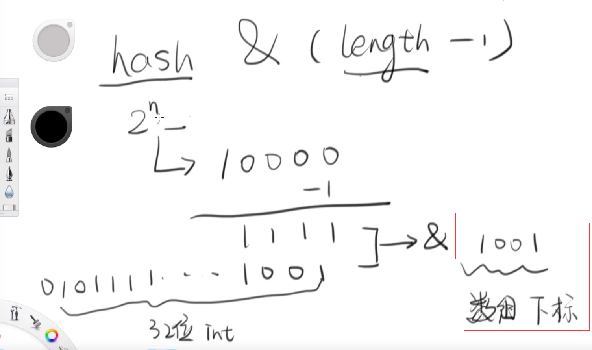

Hash表的致命缺陷 就是hash值的碰撞（collision）。


#### 1. HashMap的容量为什么是二的n次幂？

（1）首先HashMap容量初始化默认是1>>4,是16.

（2）如果我们初始化的时候指定容量不是2的幂，那么它会自动向上取2的幂。

##### 因为

​	**位运算效率高。**

Java中的hash运算是用hash值和容量-1做与运算。hash & (length - 1); 运算结果就是hash % length



```java
 /**
     * Returns index for hash code h.
     */
    static int indexFor(int h, int length) {
        // assert Integer.bitCount(length) == 1 : "length must be a non-zero power of 2";
        return h & (length-1);
    }
```

如果map容量不是2的n次幂，那么length-1的二进制表示中会有0的存在，& 运算，就会导致某个index永远不会用到。

#### 2. HashMap 1.7 与 1.8之间的区别？

（1）数组+链表/红黑树

（2）扩容的时候插入顺序的改进。

（3）函数方法：forEach(); computerIfPresent();

（4）Map的新api：merge ， replace

#### 3. HashMap 并发问题？

​	1.7版本：（1）非常容易碰到死锁。

​					 （2）潜在的安全隐患。CVE-2011-4858 ; Tomcat邮件组的讨论(链表性能退化分析)。


#### 4. hash算法：

##### （1）取模：比如说有n个hash桶，0 ~ n-1，int i，怎么和hash桶映射？

​		 最常见就是取模，i%n;

###### 		但是取模有很明显的缺点： 

​			对负数取模结果还是负数。所以得把负数先转换成正数；

​			取模效率比较慢，因为是一直在做除法。比位运算慢。

​			

#### 5. reSize效率很低，所以初始化的时候，给一个合适的容量，避免多次扩容。

