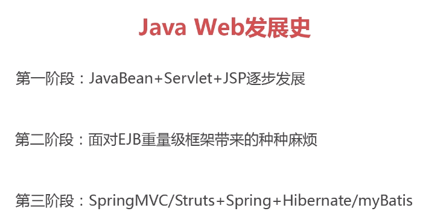
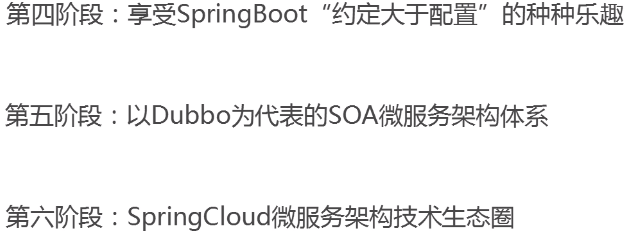
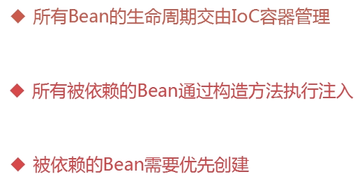
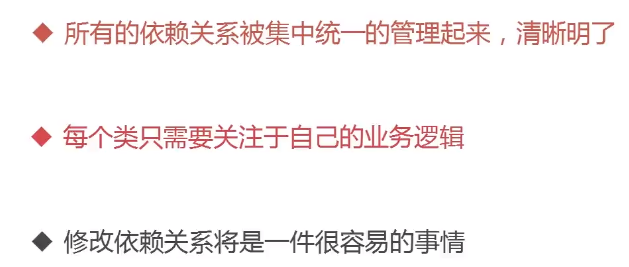
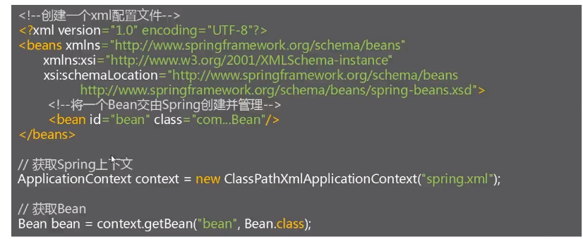
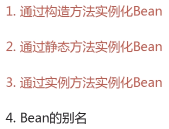

## 1. Java Web 发展史：

## 2.学习内容：IoC

### 2-1.介绍IoC 并编写一个简单的Ioc容器

##### 	IoC : Inversion of Control, 控制反转，依赖注入（ **Dependency Injection**  di）。

​	（1）控制什么？

​		控制JavaBean的创建以及销毁（生命周期）

​	（2）反转

​		将JavaBean的控制权交给IoC容器

​	（3）编写IoC

​			简单IoC的约定：

​			

代码就在md文件同级目录：ioc内

### 2-2.介绍如何通过xml方式完成SpringIoC对Bean的管理

### 2-3.Spring 实例化Bean的方式

### 2-4.介绍SpringIoC相关注解的使用

## 3.学习目的

### 3-1. 理解IoC的概念以及IoC存在的意义

### 3-2. 学会使用SpringIoC 来完成对Bean生命周期的管理

